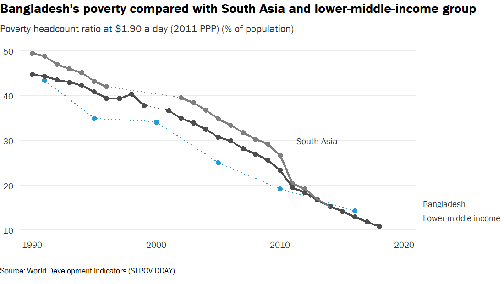
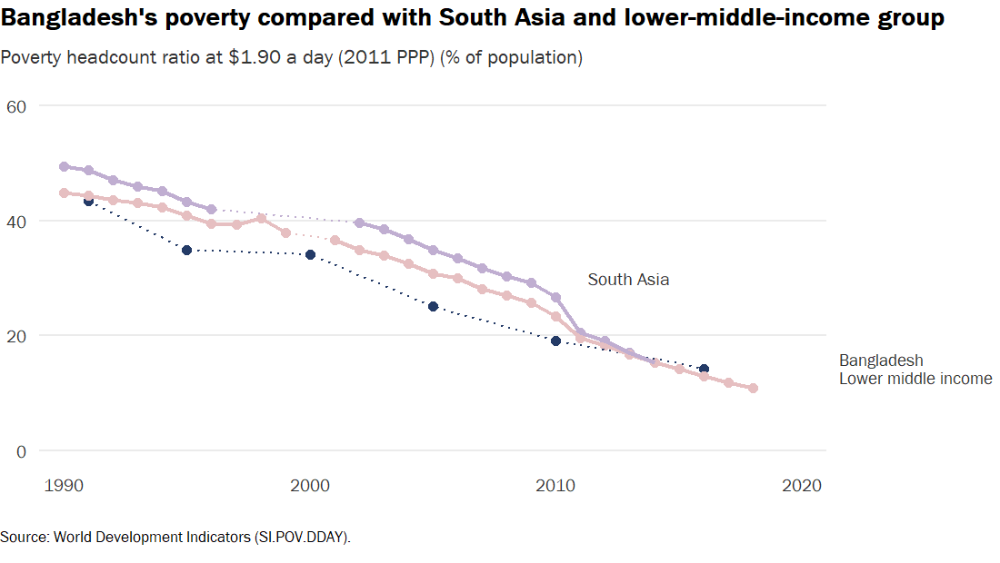
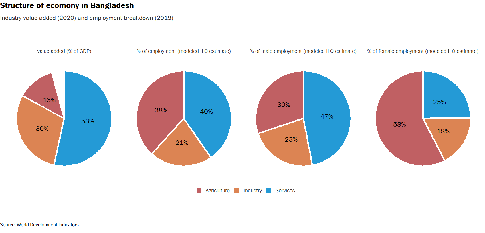

Bangladesh CCDR - 01. Chapter 1
================
03/11/2022

Chapter 1 description

     

## Economic growth

Data source: WDI

     

## Structure of economy

Data source: WDI

     

## Total energy supply (TES)

Data source:
<a href="https://www.iea.org/data-and-statistics/data-browser/?country=BANGLADESH&amp;fuel=Energy%20supply&amp;indicator=TESbySource" class="uri">https://www.iea.org/data-and-statistics/data-browser/?country=BANGLADESH&amp;fuel=Energy%20supply&amp;indicator=TESbySource</a>

     

## Natural disasters

Data source:
<a href="https://ourworldindata.org/natural-disasters" class="uri">https://ourworldindata.org/natural-disasters</a>
Country: Bangladesh Disaster type: All disasters (by type) Impact:
Deaths, Economic damages (%GDP) Timespan: Decadal average

     

## National GHG Emission Profile

Data source:
<a href="https://www.climatewatchdata.org/data-explorer/historical-emissions?historical-emissions-data-sources=cait&amp;historical-emissions-gases=all-ghg&amp;historical-emissions-regions=All%20Selected%2CBGD&amp;historical-emissions-sectors=All%20Selected&amp;page=1" class="uri">https://www.climatewatchdata.org/data-explorer/historical-emissions?historical-emissions-data-sources=cait&amp;historical-emissions-gases=all-ghg&amp;historical-emissions-regions=All%20Selected%2CBGD&amp;historical-emissions-sectors=All%20Selected&amp;page=1</a>
Source: CAIT Country: Bangladesh Sector: All selected Gases: All GHG

     

## Vulnerability score

Data source:
<a href="https://gain.nd.edu/our-work/country-index/download-data/" class="uri">https://gain.nd.edu/our-work/country-index/download-data/</a>

     

## Readiness score

Data source:
<a href="https://gain.nd.edu/our-work/country-index/download-data/" class="uri">https://gain.nd.edu/our-work/country-index/download-data/</a>

     

## ND-GAIN

Data source:
<a href="https://gain.nd.edu/our-work/country-index/download-data/" class="uri">https://gain.nd.edu/our-work/country-index/download-data/</a>

