Bangladesh CCDR - 01. Chapter 1
================
03/11/2022

Chapter 1 description

     

## Economic growth and poverty

Data source: WDI

Indicators: NY.GDP.PCAP.PP.CD

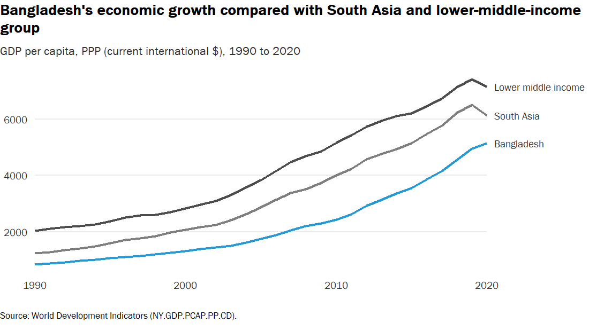

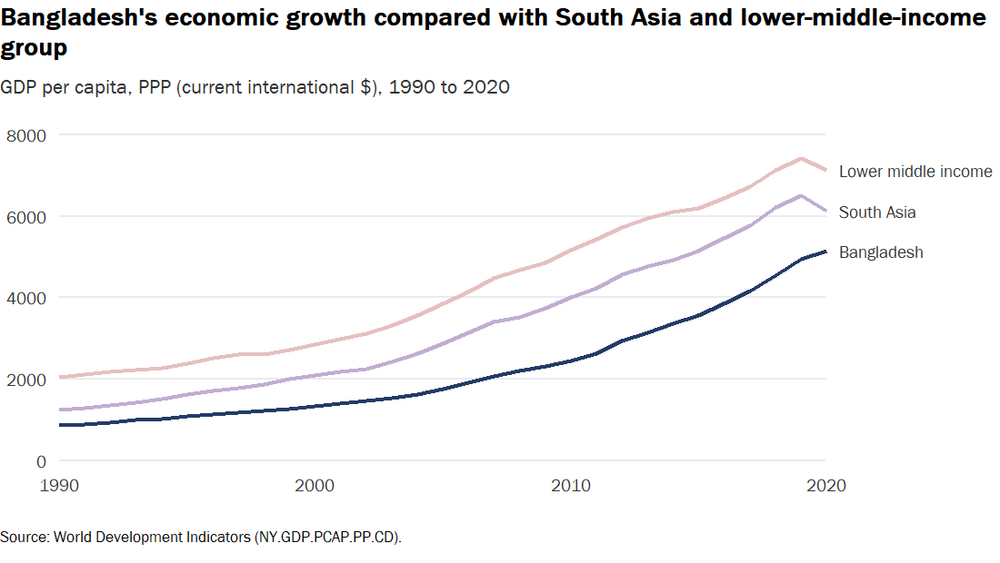

Data source: WDI

Indicators: SI.POV.DDAY

Data source: WDI

Indicators: NY.GDP.PCAP.PP.CD, SI.POV.DDAY

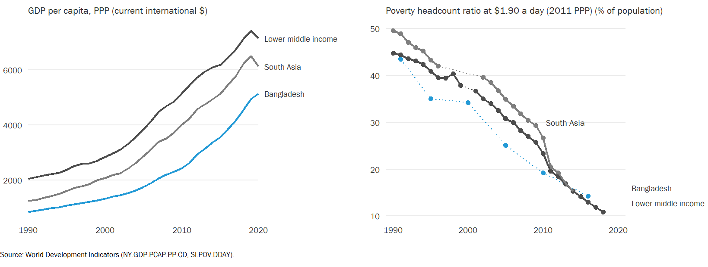

     

## Structure of economy

Data source: WDI

Indicators: “NV.AGR.TOTL.ZS”, “NV.IND.TOTL.ZS”, “NV.SRV.TOTL.ZS”,
“SL.AGR.EMPL.ZS”, “SL.IND.EMPL.ZS”, “SL.SRV.EMPL.ZS”,
“SL.AGR.EMPL.MA.ZS”, “SL.IND.EMPL.MA.ZS”, “SL.SRV.EMPL.MA.ZS”,
“SL.AGR.EMPL.FE.ZS”, “SL.IND.EMPL.FE.ZS”, “SL.SRV.EMPL.FE.ZS”

     

## Total energy supply (TES)

Data source:
<https://www.iea.org/data-and-statistics/data-browser/?country=BANGLADESH&fuel=Energy%20supply&indicator=TESbySource>

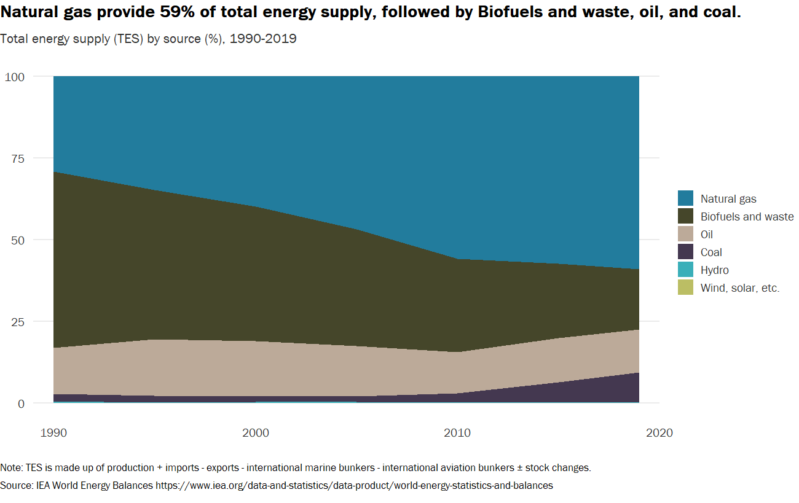

     

## Natural disasters

Data source: <https://ourworldindata.org/natural-disasters>

Country: Bangladesh

Disaster type: All disasters (by type)

Impact: Deaths, Economic damages (%GDP)

Timespan: Decadal average

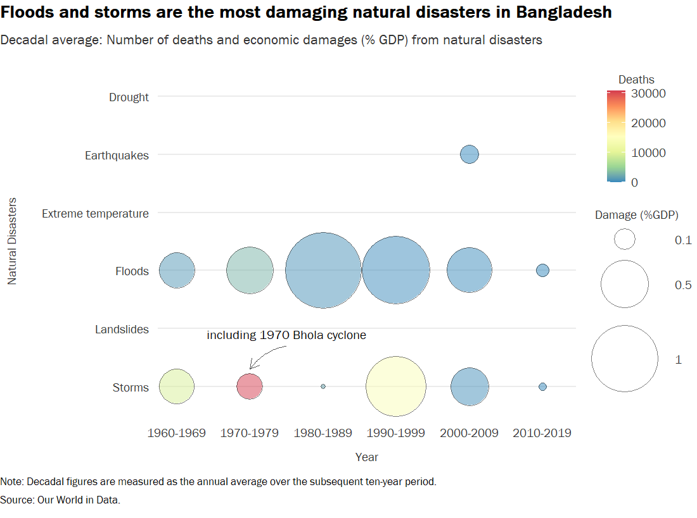

Data source: <https://public.emdat.be/data>

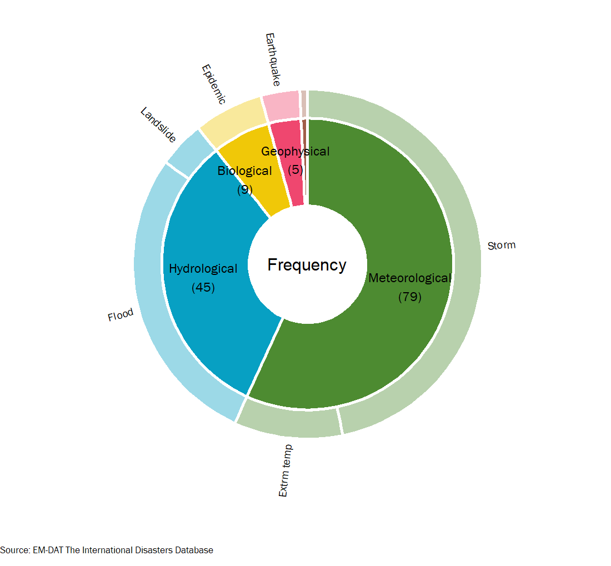

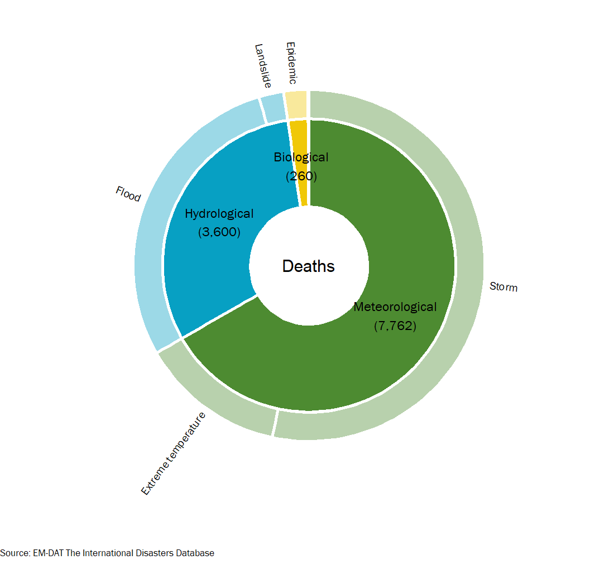

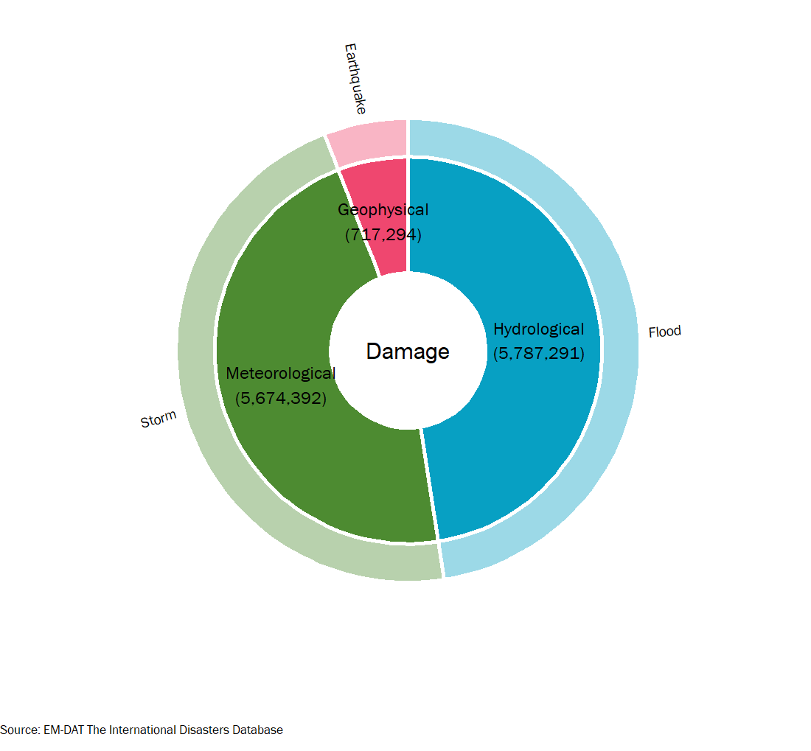

     

## National GHG Emission Profile

<https://www.climatewatchdata.org/ghg-emissions?breakBy=sector&chartType=area&end_year=2018&regions=BGD&sectors=total-including-lucf&start_year=1990>

Source: CAIT

Country: Bangladesh

Sector: Total including LUCF

Gases: All GHG

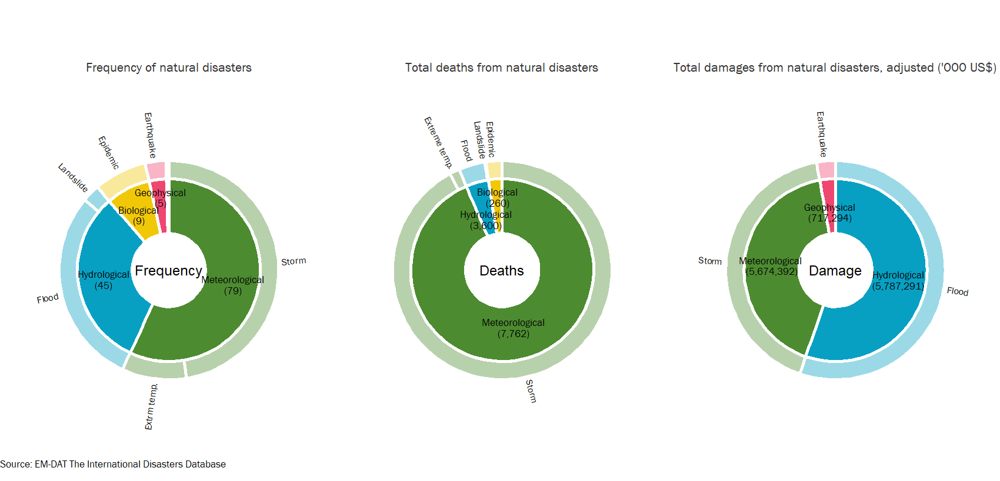

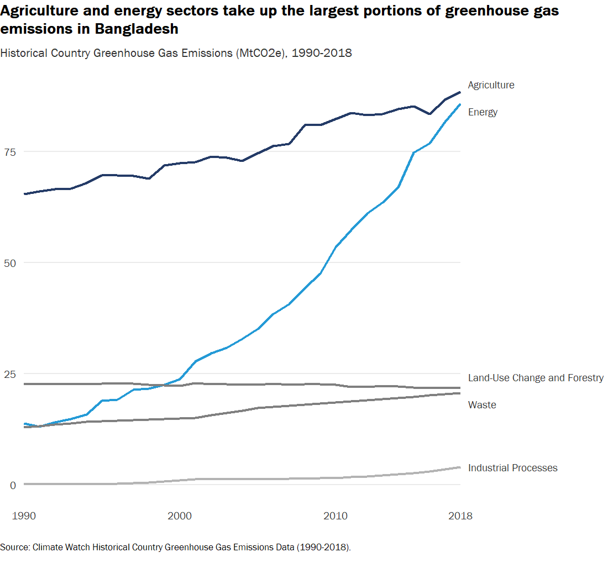

     

## Vulnerability score

Data source: <https://gain.nd.edu/our-work/country-index/download-data/>

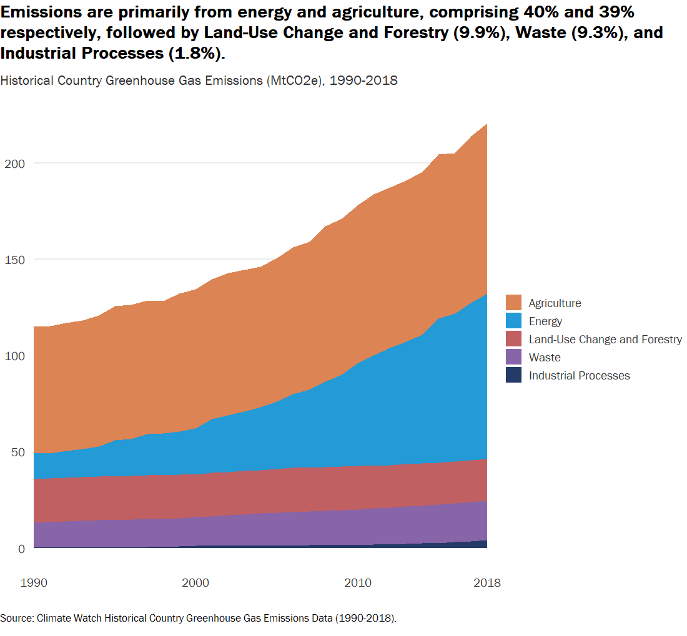

     

## Readiness score

Data source: <https://gain.nd.edu/our-work/country-index/download-data/>

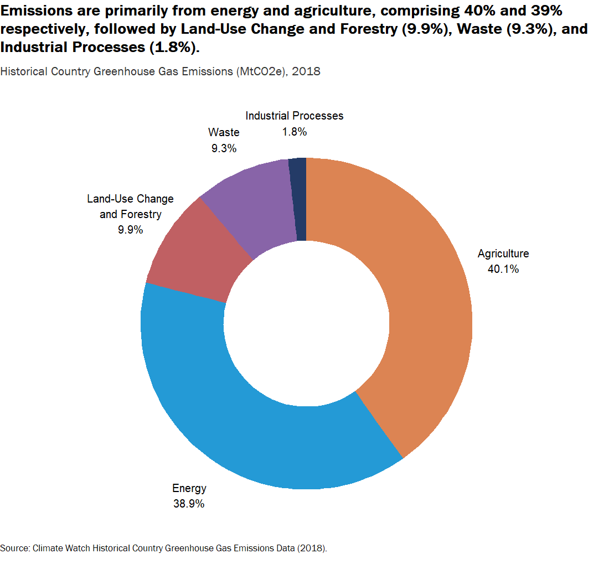

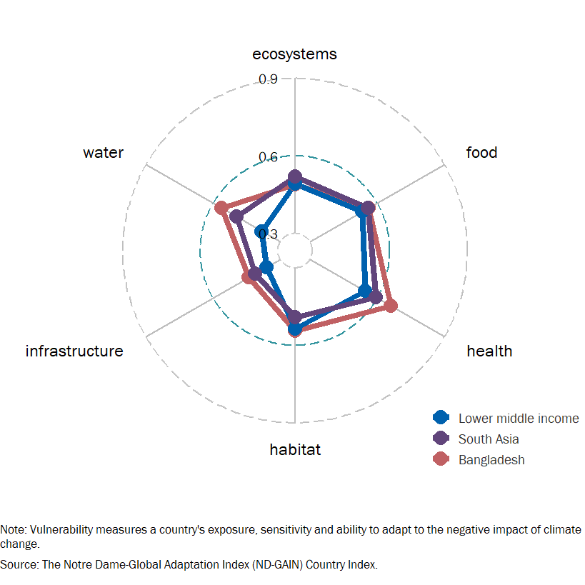

     

## ND-GAIN

Data source: <https://gain.nd.edu/our-work/country-index/download-data/>

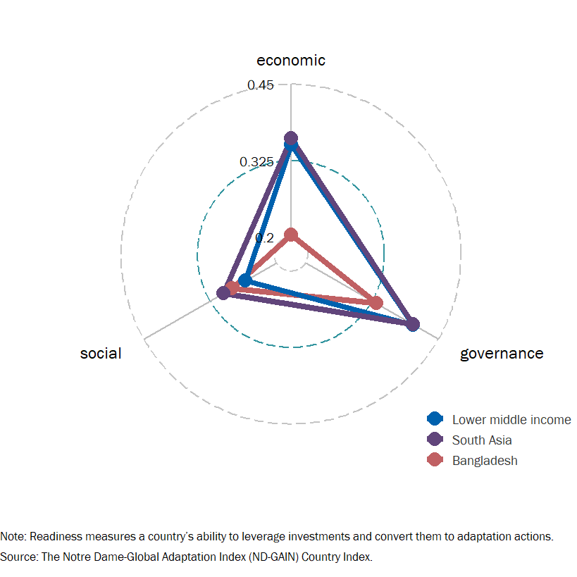
