Nepal CCDR - 01. Chapter 1
================
03/11/2022

Chapter 1 description

     

## Economic growth and poverty

Data source: WDI

Indicators: NY.GDP.PCAP.PP.CD

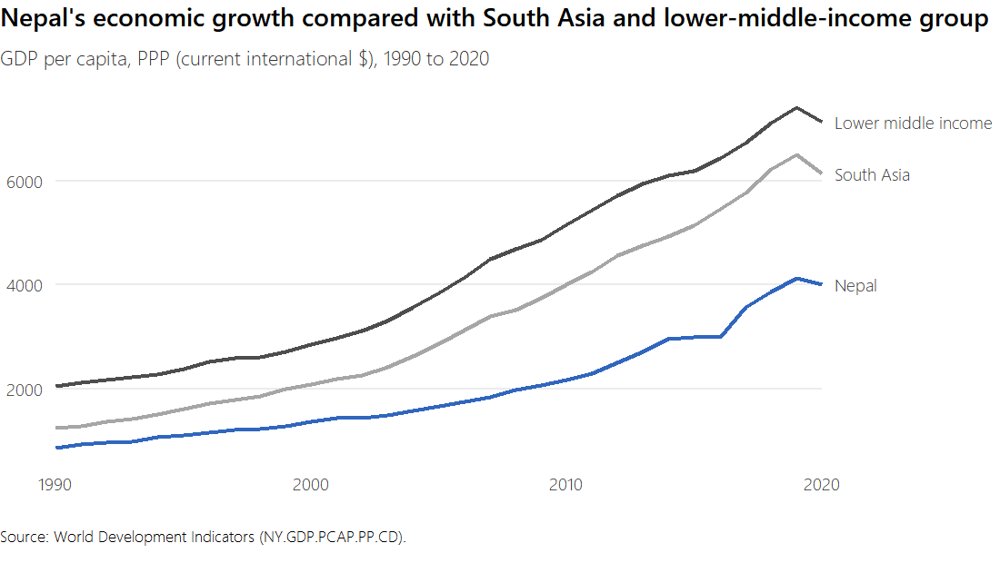

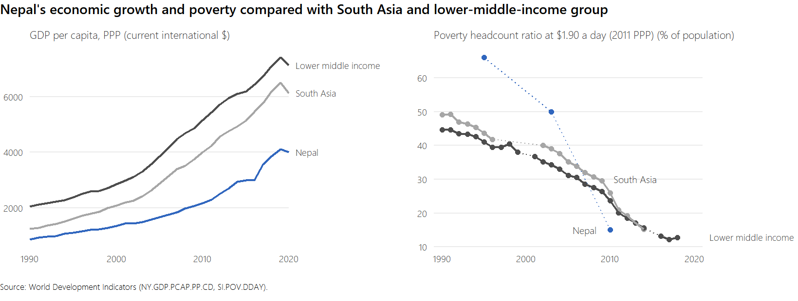

Data source: WDI

Indicators: SI.POV.DDAY

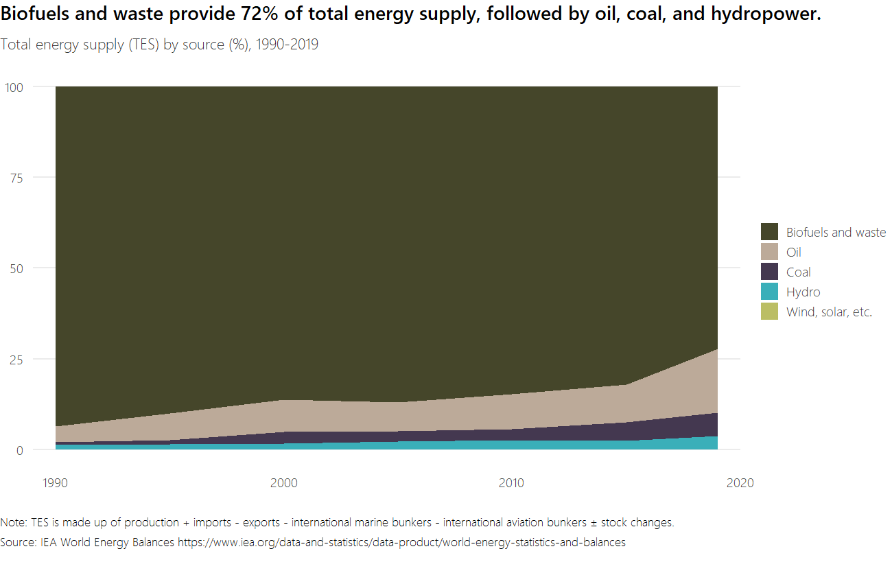

Data source: WDI

Indicators: NY.GDP.PCAP.PP.CD, SI.POV.DDAY

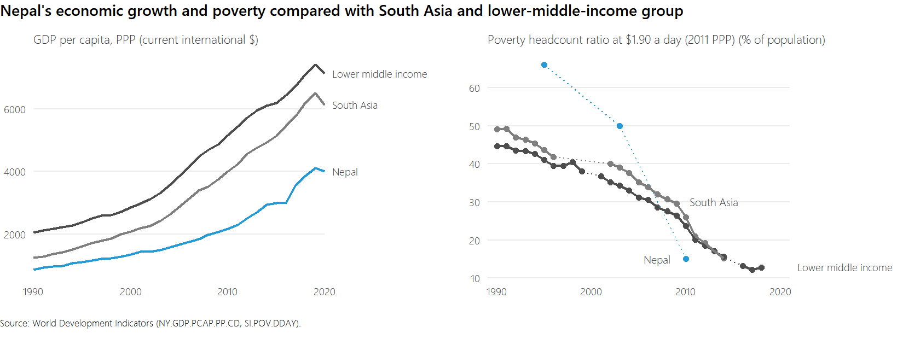

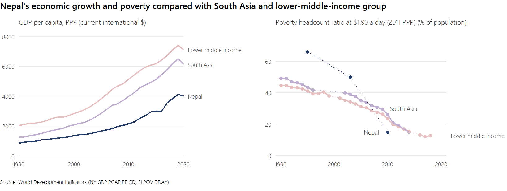

     

## Structure of economy

Data source: WDI

Indicators: “NV.AGR.TOTL.ZS”, “NV.IND.TOTL.ZS”, “NV.SRV.TOTL.ZS”,
“SL.AGR.EMPL.ZS”, “SL.IND.EMPL.ZS”, “SL.SRV.EMPL.ZS”,
“SL.AGR.EMPL.MA.ZS”, “SL.IND.EMPL.MA.ZS”, “SL.SRV.EMPL.MA.ZS”,
“SL.AGR.EMPL.FE.ZS”, “SL.IND.EMPL.FE.ZS”, “SL.SRV.EMPL.FE.ZS”

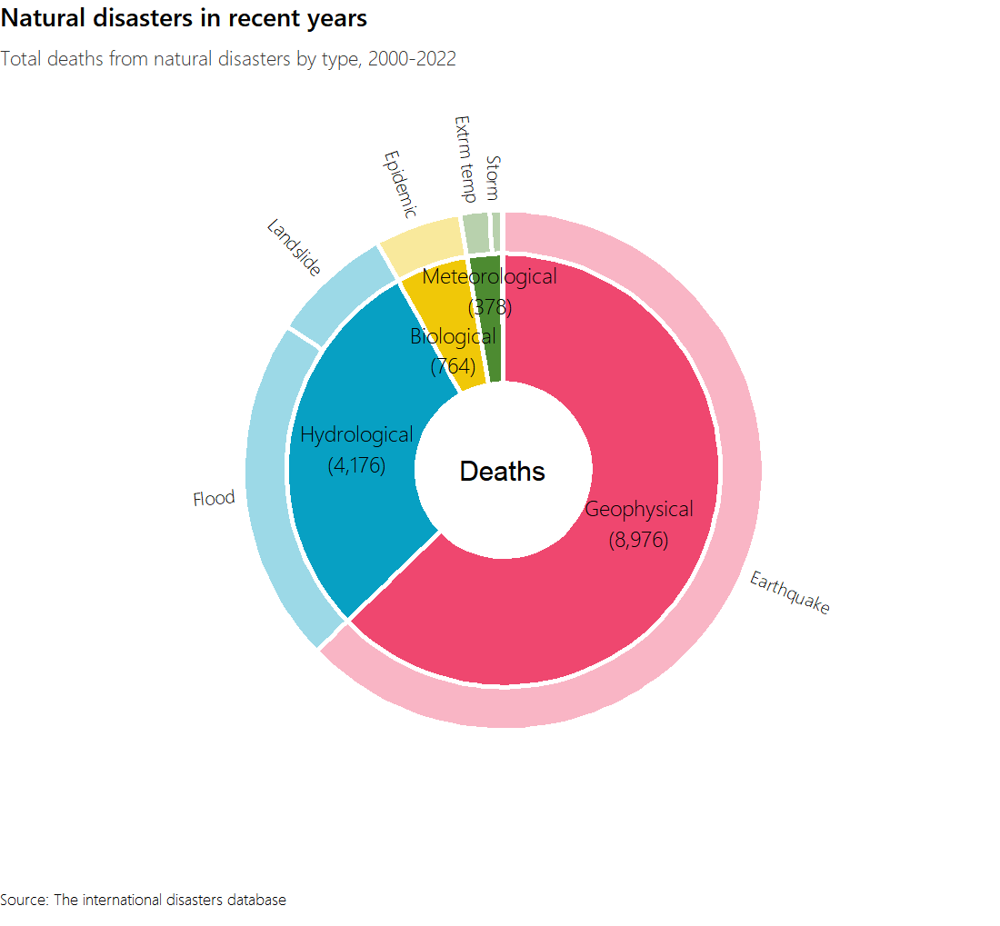

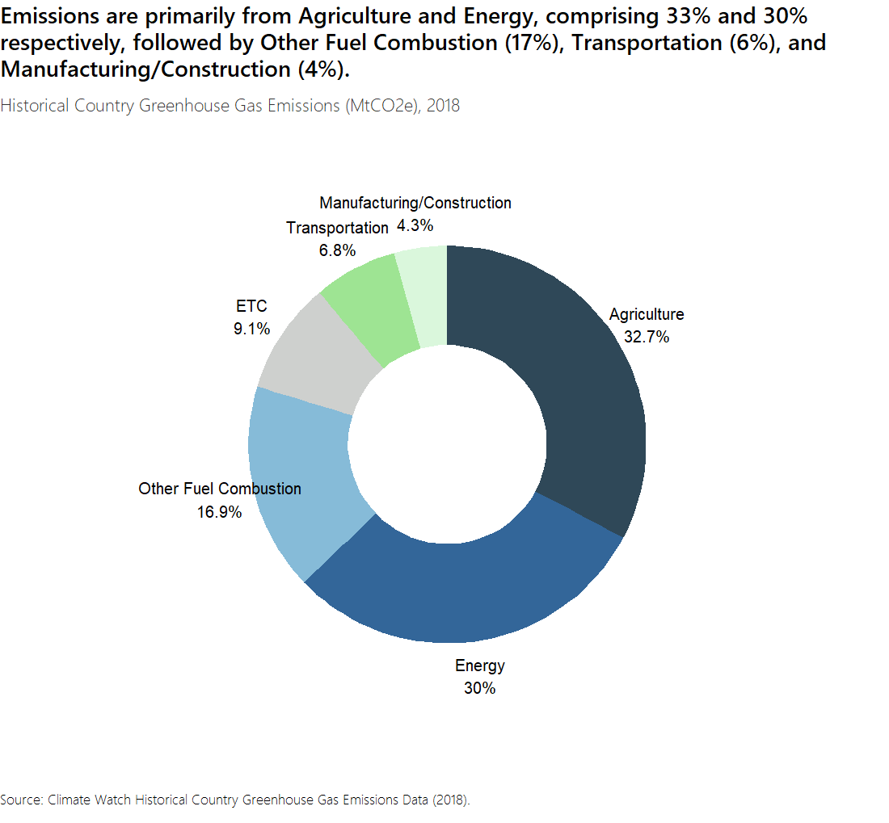

     

## Total energy supply (TES)

Data source:
<a href="https://www.iea.org/data-and-statistics/data-browser/?country=NEPAL&amp;fuel=Energy%20supply&amp;indicator=TESbySource" class="uri">https://www.iea.org/data-and-statistics/data-browser/?country=NEPAL&amp;fuel=Energy%20supply&amp;indicator=TESbySource</a>

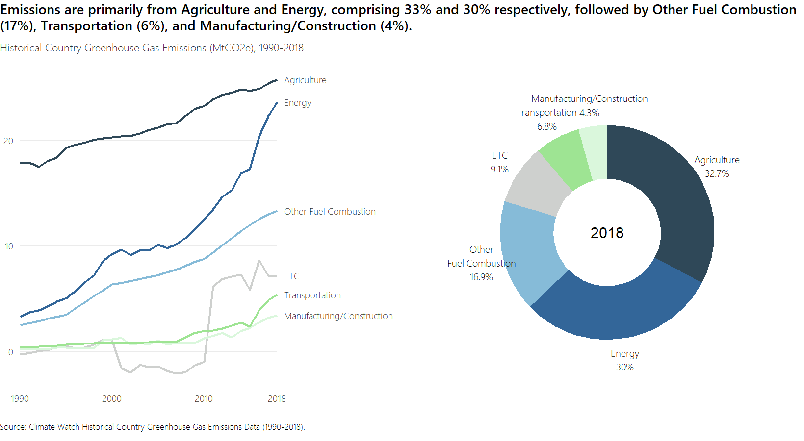

     

## Natural disasters

Data source:
<a href="https://ourworldindata.org/natural-disasters" class="uri">https://ourworldindata.org/natural-disasters</a>

Country: Nepal

Disaster type: All disasters (by type)

Impact: Deaths, Economic damages (%GDP)

Timespan: Decadal average

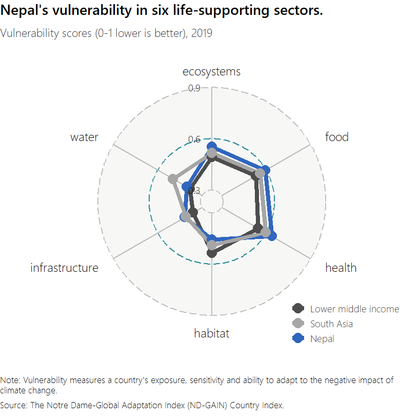

Data source:
<a href="https://public.emdat.be/data" class="uri">https://public.emdat.be/data</a>

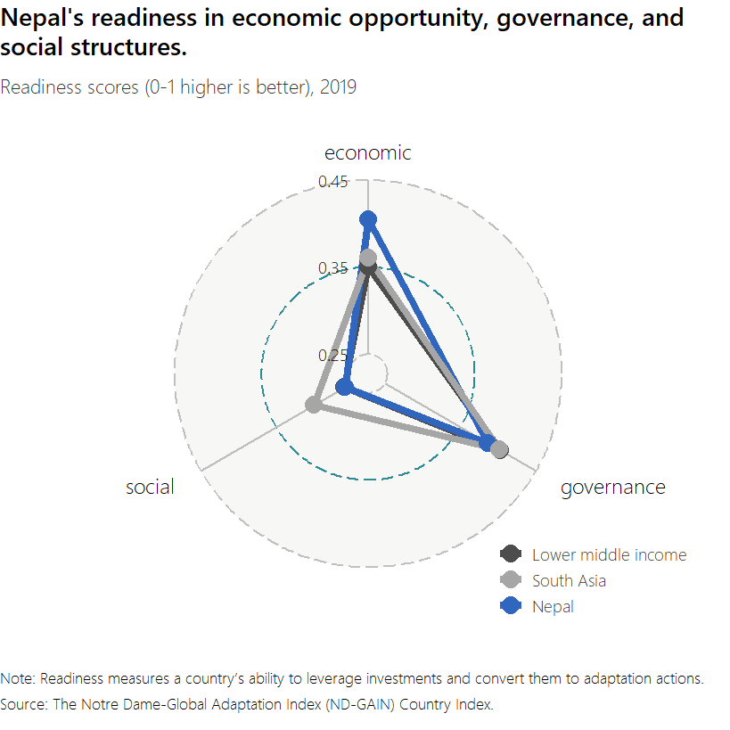

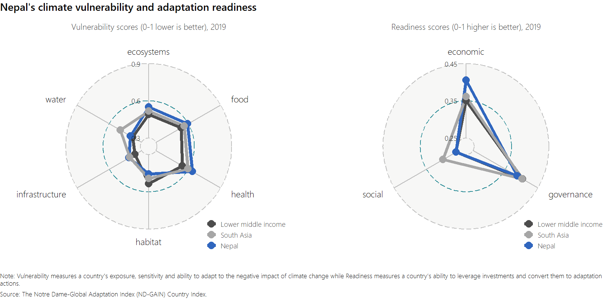

     

## National GHG Emission Profile

Data source:
<a href="https://www.climatewatchdata.org/ghg-emissions?breakBy=sector&amp;chartType=area&amp;end_year=2018&amp;regions=NPL&amp;sectors=total-including-lucf&amp;start_year=1990" class="uri">https://www.climatewatchdata.org/ghg-emissions?breakBy=sector&amp;chartType=area&amp;end_year=2018&amp;regions=NPL&amp;sectors=total-including-lucf&amp;start_year=1990</a>

Source: CAIT

Country: Nepal

Sector: Total including LUCF

Gases: All GHG

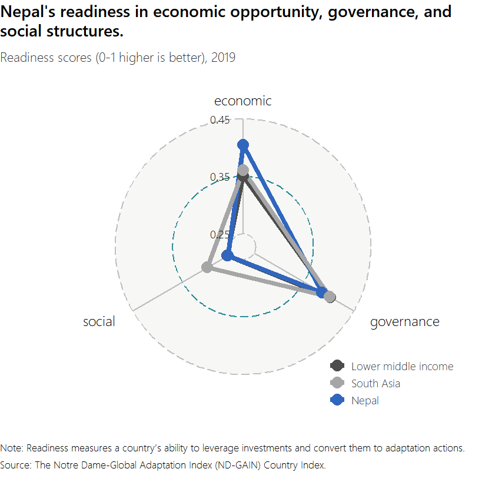

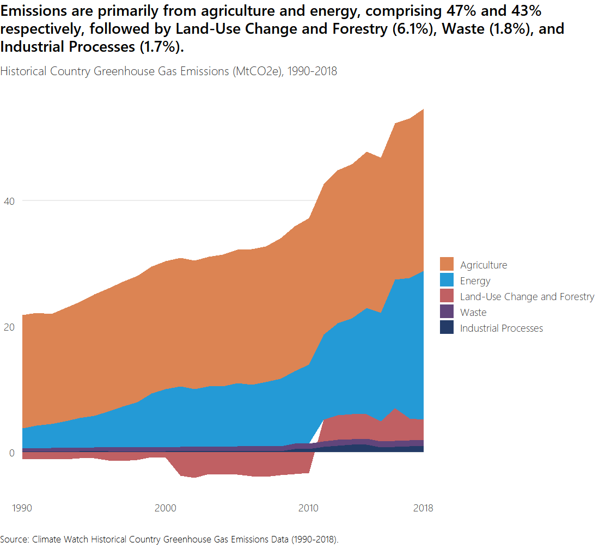

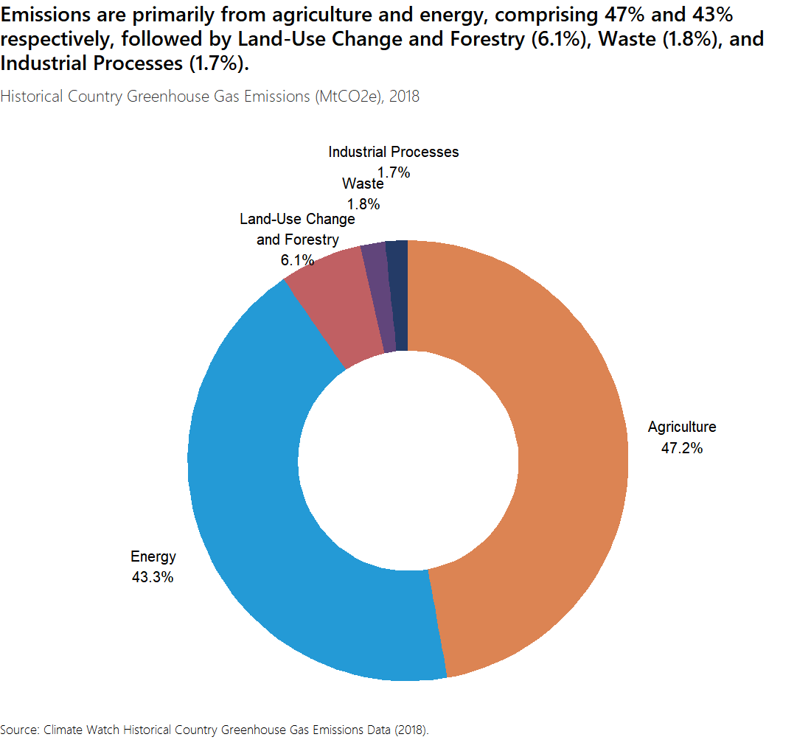

     

## Vulnerability score

Data source:
<a href="https://gain.nd.edu/our-work/country-index/download-data/" class="uri">https://gain.nd.edu/our-work/country-index/download-data/</a>

     

## Readiness score

Data source:
<a href="https://gain.nd.edu/our-work/country-index/download-data/" class="uri">https://gain.nd.edu/our-work/country-index/download-data/</a>

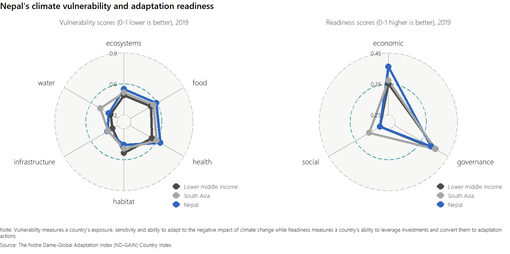

     

## ND-GAIN

Data source:
<a href="https://gain.nd.edu/our-work/country-index/download-data/" class="uri">https://gain.nd.edu/our-work/country-index/download-data/</a>

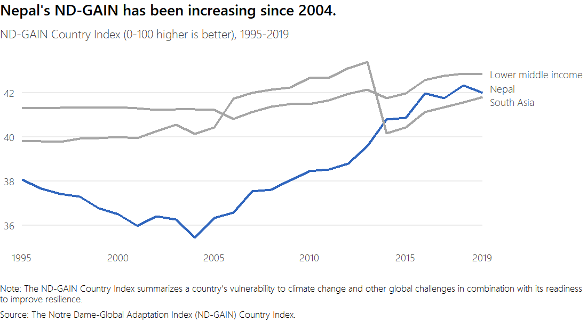
