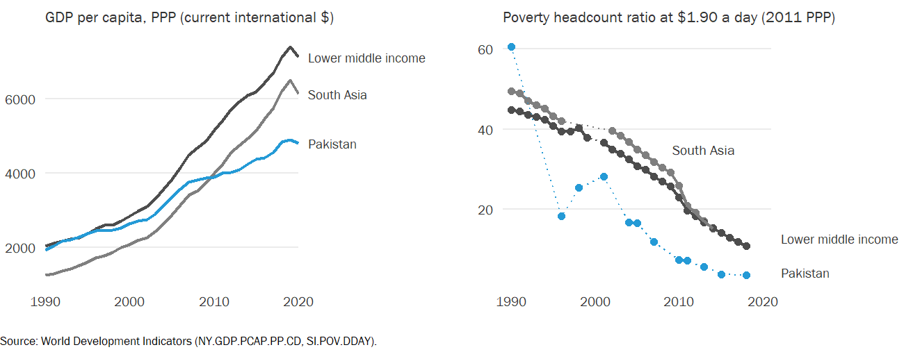
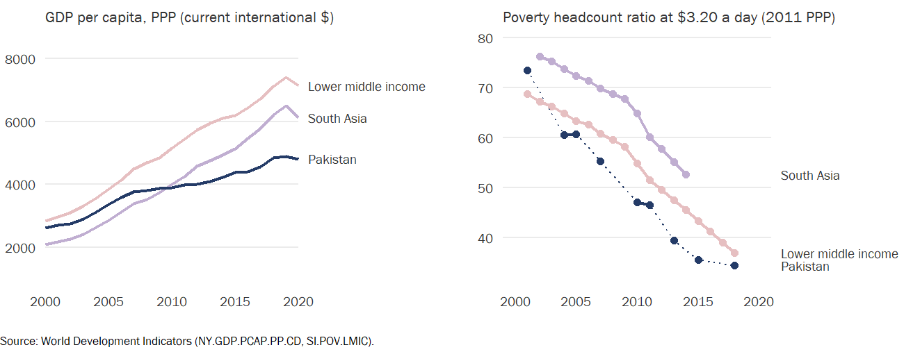
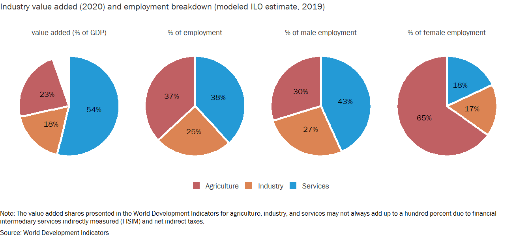
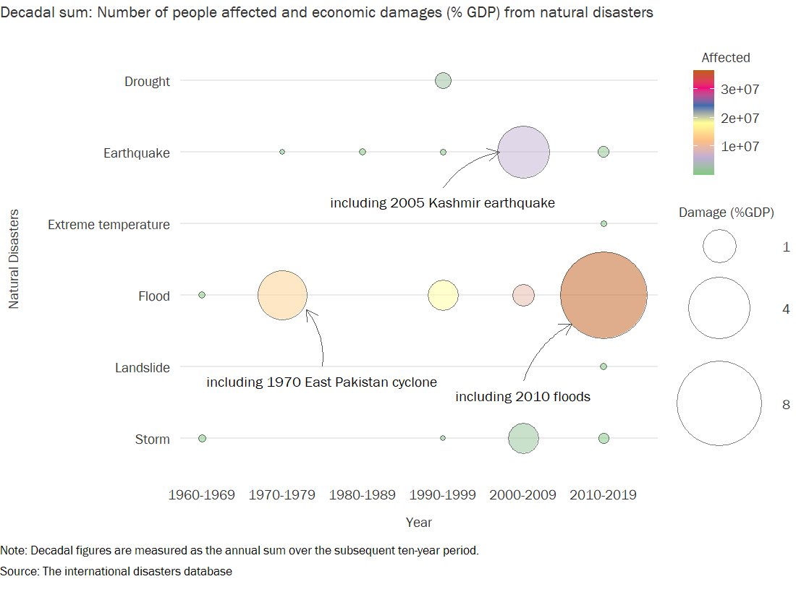
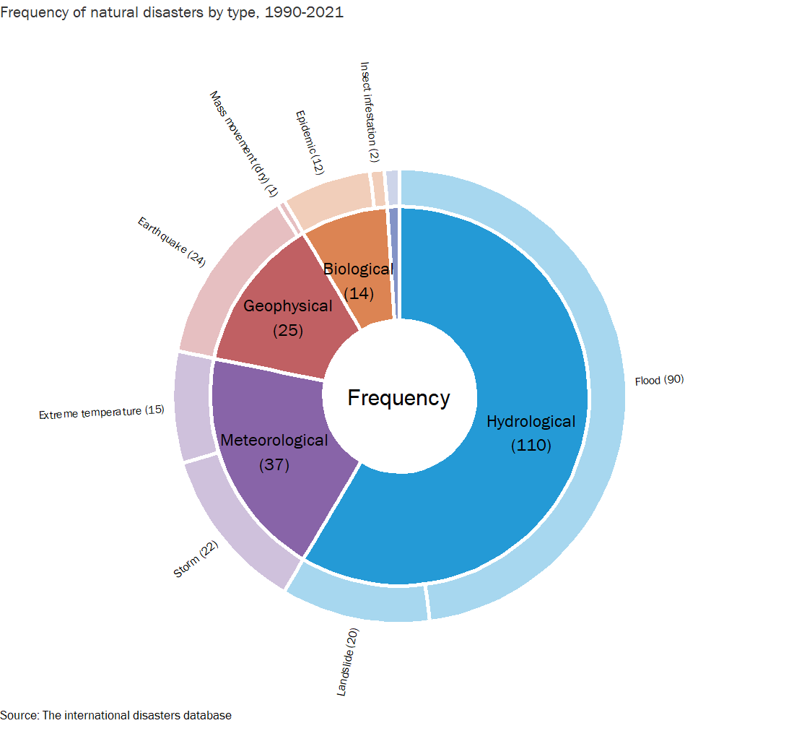
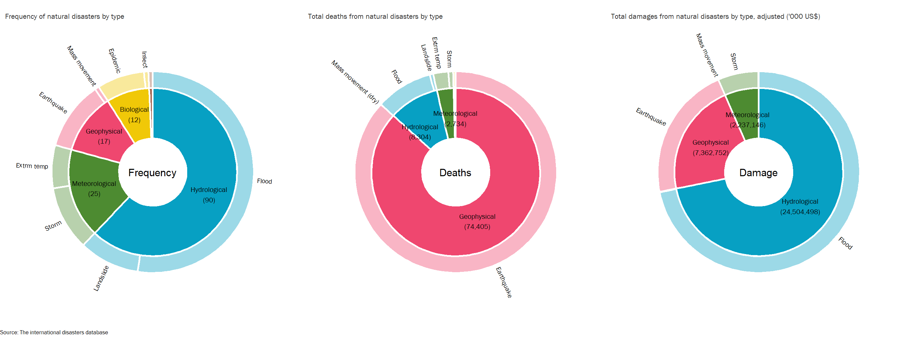

Pakistan CCDR - 01. Climate and Development
================
03/11/2022

This chapter will place Pakistan’s core development priorities and
challenges in the context of climate change. and assess the immediate
and longer-term risks to sustainable and inclusive development from
climate change. The assessment of Pakistan’s core development priorities
will be placed in the context of the government’s development vision and
revised NDCs, the draft World Bank’s Country Partnership Framework (CPF)
and the Country Climate Action Plan (CCAP) for Pakistan. It will
summarize the main sectoral, macro-fiscal and financial opportunities to
address critical development needs while building climate resilience and
reducing emissions, with a focus on synergistic short- and medium-term
strategies that are urgent for sustainable and inclusive growth and
poverty reduction while transitioning to a resilient and low carbon
economy.

     

## Economic growth and poverty

Data source: WDI

Indicators: NY.GDP.PCAP.PP.CD

Data source: WDI

Indicators: SI.POV.DDAY

Data source: WDI

Indicators: NY.GDP.PCAP.PP.CD, SI.POV.DDAY

     

## Structure of economy

Data source: WDI

Indicators: “NV.AGR.TOTL.ZS”, “NV.IND.TOTL.ZS”, “NV.SRV.TOTL.ZS”,
“SL.AGR.EMPL.ZS”, “SL.IND.EMPL.ZS”, “SL.SRV.EMPL.ZS”,
“SL.AGR.EMPL.MA.ZS”, “SL.IND.EMPL.MA.ZS”, “SL.SRV.EMPL.MA.ZS”,
“SL.AGR.EMPL.FE.ZS”, “SL.IND.EMPL.FE.ZS”, “SL.SRV.EMPL.FE.ZS”

     

## Total energy supply (TES)

Data source:
<a href="https://www.iea.org/data-and-statistics/data-browser/?country=PAKISTAN&amp;fuel=Energy%20supply&amp;indicator=TESbySource" class="uri">https://www.iea.org/data-and-statistics/data-browser/?country=PAKISTAN&amp;fuel=Energy%20supply&amp;indicator=TESbySource</a>

     

## Natural disasters

Data source:
<a href="https://ourworldindata.org/natural-disasters" class="uri">https://ourworldindata.org/natural-disasters</a>

Country: Pakistan

Disaster type: All disasters (by type)

Impact: Deaths, Economic damages (%GDP)

Timespan: Decadal average

Data source:
<a href="https://public.emdat.be/data" class="uri">https://public.emdat.be/data</a>

     

## Projected temperatures

Data source:
<a href="https://climateknowledgeportal.worldbank.org/country/pakistan/climate-data-projections" class="uri">https://climateknowledgeportal.worldbank.org/country/pakistan/climate-data-projections</a>

     

## National GHG Emission Profile

Data source:
<a href="https://www.climatewatchdata.org/ghg-emissions?breakBy=sector&amp;chartType=area&amp;end_year=2018&amp;regions=PAK&amp;sectors=total-including-lucf&amp;start_year=1990" class="uri">https://www.climatewatchdata.org/ghg-emissions?breakBy=sector&amp;chartType=area&amp;end_year=2018&amp;regions=PAK&amp;sectors=total-including-lucf&amp;start_year=1990</a>

Source: CAIT

Country: Pakistan

Sector: Total including LUCF

Gases: All GHG

     

## Vulnerability score

Data source:
<a href="https://gain.nd.edu/our-work/country-index/download-data/" class="uri">https://gain.nd.edu/our-work/country-index/download-data/</a>

     

## Readiness score

Data source:
<a href="https://gain.nd.edu/our-work/country-index/download-data/" class="uri">https://gain.nd.edu/our-work/country-index/download-data/</a>

     

## ND-GAIN

Data source:
<a href="https://gain.nd.edu/our-work/country-index/download-data/" class="uri">https://gain.nd.edu/our-work/country-index/download-data/</a>

