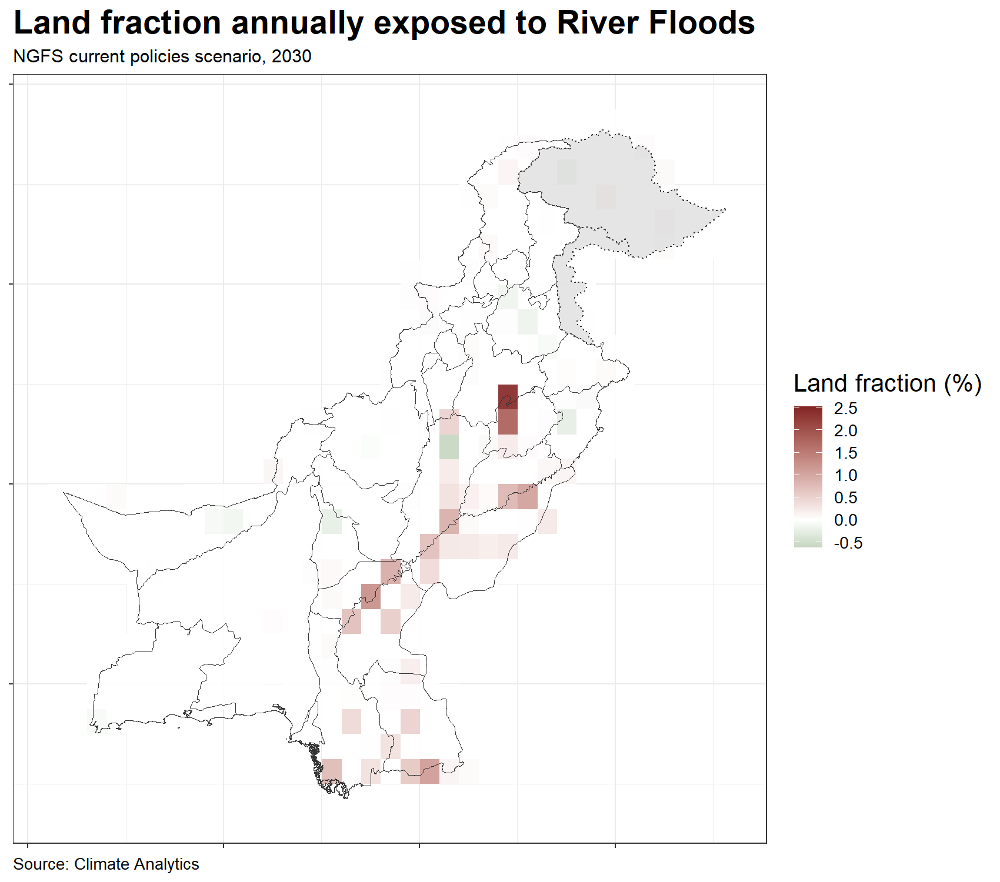

Pakistan CCDR - 02. The Macro-Fiscal, Financial and Distributional
Impacts of Climate Risks
================
03/11/2022

This chapter assesses the macro-fiscal, financial, and distributional
risks posed by climate change and environmental degradation to
Pakistan’s development path. Both physical and transition related risks
are assessed, including those arising from international decarbonization
policies. It identifies the main channels through which the impacts of
climate change will be transmitted and evaluates associated
macro-fiscal, sectoral, financial, and distributional implications.

     

## Relative change in crop yield

     

## Relative change in annual expected damage

     

## Relative Wealth Index

     

## Crop Failures

     

## River Floods

     

## Heat Stress

