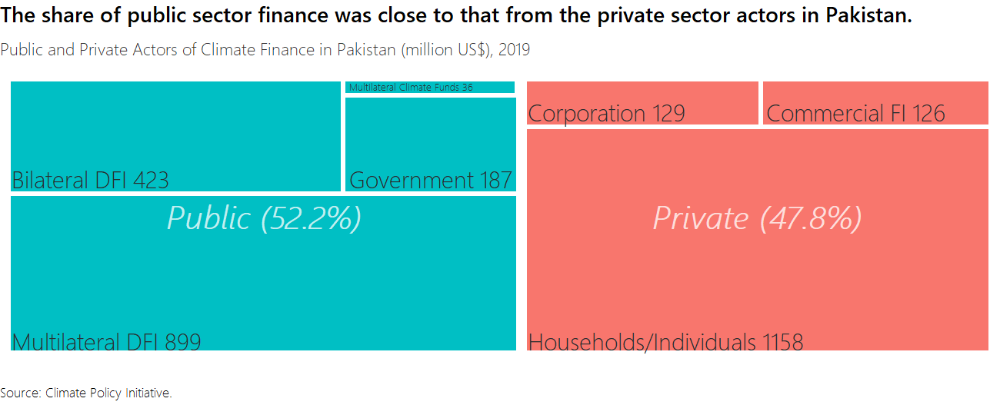
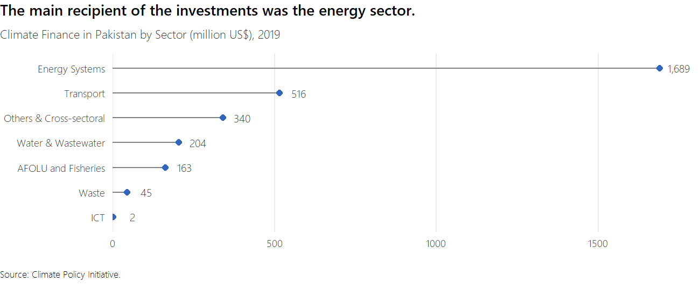

Pakistan CCDR - 03. Country Climate Commitments and Opportunities for
Upscaling Climate Action
================
03/11/2022

This chapter will assess the level of ambition and progress to date of
existing country climate commitments and policies for building
resilience and accelerating decarbonization, including Pakistan’s
revised NDCs and assess the extent to which the full implementation of
promised NDCs could be constrained by the policy or institutional
framework. It will also look at existing private sector engagement in
adaptation and mitigation activities and assess options for scaling up
private sector participation through policy and institutional reform, as
well as the greening of domestic financial institutions. It will provide
an overview of green finance markets and instruments and identify policy
priorities for their development, with a focus on de-risking, risk
transfer, and credit enhancement instruments for climate investment in
strategic sectors (urban infrastructure, green transport, renewable
energy, agriculture, circular economy). The analysis will be informed by
ongoing analytical work under the CEM and IFC investment and advisory on
greening of the banking sector and green bonds market, and on-going
financial sector work. The expected spending needs along with financing
capacities from various sources including the government, private sector
and the international development community will be assessed. The
analysis will include an evaluation of the potential challenges posed by
Pakistan’s federal structure, which has delegated responsibility for
most sectoral actions to provinces. It will also examine the ways in
which climate actions could be impeded by the institutional design of
government departments at the national and provincial levels, or by
policies that sustain the underpricing of natural or common pool
resources and energy.

     

## Actors of climate finance

     

## Climate finance by sector

## Strengthening Policy and Institutional Frameworks to Enable Climate Action
